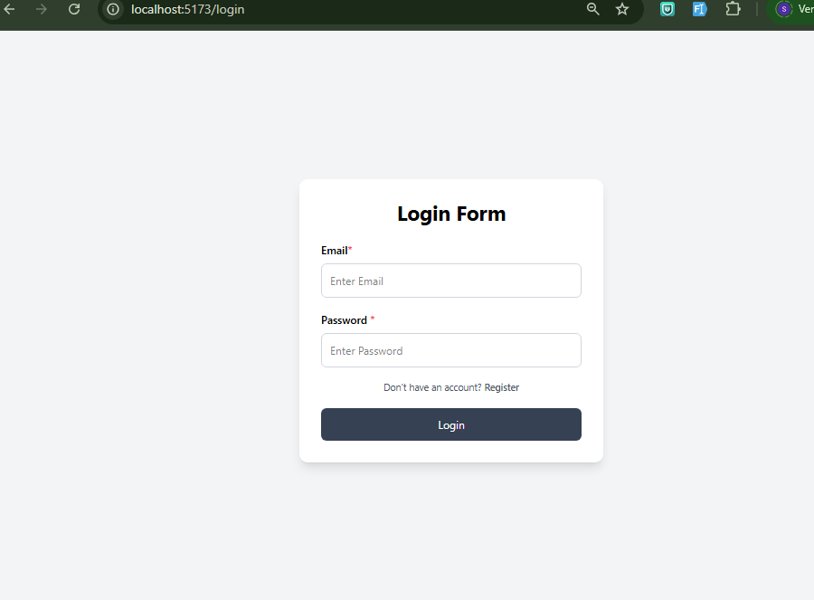
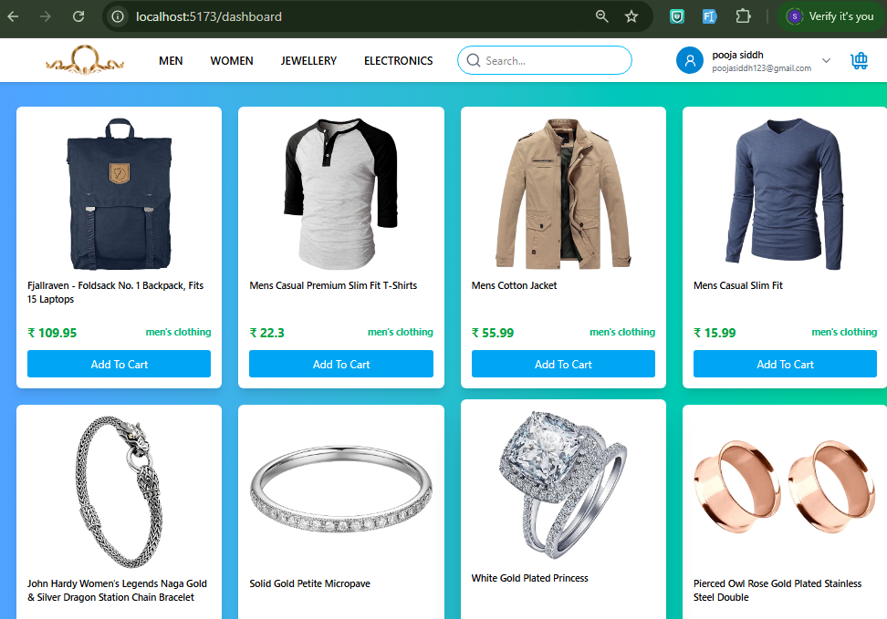

# React Authentication & Product Dashboard

## 🚀 Live Demo

🌐 https://react-auth-product-dashboard.vercel.app

## 📂 GitHub Repository

🔗 https://github.com/poojasiddh/react-auth-product-dashboard

# React Authentication & Product Dashboard

A modern React.js application that provides user authentication, product listing, product details, and dashboard functionality using Context API without any backend database.

---

## Features

- User Registration with Form Validation
- Login Authentication
- Context API for State Management
- Protected Dashboard
- Product Listing using API
- Product Details Page
- Search Products
- Logout Functionality
- Responsive UI using Tailwind CSS

---

## Technologies Used

- React.js
- Vite
- JavaScript (ES6)
- Tailwind CSS
- React Router DOM
- Context API
- Axios
- Fetch API

---

## Authentication Flow

1. User Registration
2. Form Validation
3. Store User Data using Context API
4. Login using Registered Email & Password
5. Redirect to Dashboard
6. Logout

---

## API Integration

Product data is fetched from Fake Store API using:

- Fetch API
- Axios

---

## Project Structure

## 📸 Screenshots

### Register Page

### Login Page

### Dashboard

### Product Detail

